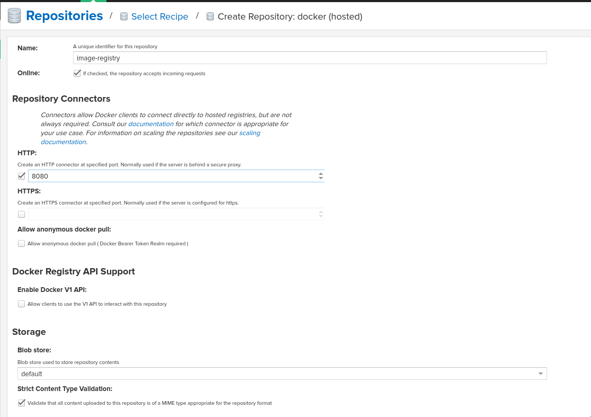

OPENSHIFT 4 IMAGE SIGNATURE VERIFICATION WORK-IN-PROGRESS DEMO
==============================================================

With OpenShift 4, container image signatures can be verified at deploy time by configuring CRI-O to use GPG keys.
This repo contains a walkthrough/demo of this feature and a simple solution to signature storage. This demo will use:

- Openshift 4 as the container platform
- An external Sonatype Nexus instance to simulate a private docker registry
- GPG to sign/verify container images
- NGINX + LuaJIT as the application framework (OpenResty)

Signatures can also be stored inside Nexus, so if this is the intended workflow, the NGINX signature server is not required.

PREREQUISITES
-------------

1) Install Openshift 4.x

2) Generate a GPG Key that will be used to sign images

.. code:: bash

    # gpg --quick-gen-key demo@redhat.com
    # gpg -k
    [...]
    pub   rsa2048 2020-04-24 [SC] [expires: 2022-04-24]
      01164344435F9572F7B8B06D48790DBE02151245
    uid           [ultimate] demo@redhat.com
    sub   rsa2048 2020-04-24 [E]
    [...]

3) Export the public key to file

.. code:: bash

    # gpg --armor --export demo@redhat.com > nexus-key.gpg

4) Deploy an instance of Nexus

.. code:: bash

    # oc create -f components/nexus-deployment.yaml

5) On the nexus web interface, create a new Hosted Docker repository.

6) If you are using a self-signed certificate on the ingress controllers, the local nexus needs to be added to the list of `insecure`_ registries:

.. code:: bash

  # oc edit image.config.openshift.io/cluster

.. code:: yaml

  apiVersion: config.openshift.io/v1
  kind: Image
  metadata:
    annotations:
      release.openshift.io/create-only: "true"
    creationTimestamp: 2020-05-05T05:21:57Z
    generation: 2
    name: cluster
    resourceVersion: "80728"
    selfLink: /apis/config.openshift.io/v1/images/cluster
    uid: 5576bd84-9e0c-4d67-9498-9c8cf523cbd2
  spec:
    registrySources:
      insecureRegistries:
      - nexus-registry.apps.ocp4.sandbox595.opentlc.com
  status:
    internalRegistryHostname: image-registry.openshift-image-registry.svc:5000

The MachineConfigOperator monitors that resource for differences and applies the new config when appropriate.

7) If the image registry created on nexus needs authentication, a pull secret needs to be created and linked to the correct ServiceAccount

.. code:: bash 

  # oc create secret docker-registry nexus-pull-secret --docker-server=nexus-registry.apps.ocp4.sandbox595.opentlc.com --docker-username=<username> --docker-password=<password> --docker-email=unused

For example, if the 'demo-sa' is used to deploy pods with a deploymentConfig, this pull secret needs to be linked to that SA:

.. code:: bash

  # oc create sa demo-sa
  # oc secrets link demo-sa nexus-pull-secret --for=pull

To assign the pull secret to the 'default' service account (the SA that is used when no other is specified):

.. code:: bash

  # oc secrets link default nexus-pull-secret --for=pull

CONFIGURE OPENSHIFT NODES
-------------------------

This demo uses a local instance of Nexus as an external image repository. We want images coming from that repo to be signed and verified.
Worker (and masters optionally) nodes in an OCP cluster need to be made aware of a new repo that requires signature verification.

1) Configure a policy.json file with all repositories that need signature verification. Specify the public key path every repo section:

.. code:: json

    {
      "default": [
        {
          "type": "insecureAcceptAnything"
        }
      ],
      "transports": {
        "docker": {
          "registry.access.redhat.com": [
            {
              "type": "signedBy",
              "keyType": "GPGKeys",
              "keyPath": "/etc/pki/rpm-gpg/RPM-GPG-KEY-redhat-release"
            }
          ],
          "registry.redhat.io": [
            {
              "type": "signedBy",
              "keyType": "GPGKeys",
              "keyPath": "/etc/pki/rpm-gpg/RPM-GPG-KEY-redhat-release"
            }
          ],
          "nexus-registry.apps.ocp4.sandbox595.opentlc.com": [
            {
              "type": "signedBy",
              "keyType": "GPGKeys",
              "keyPath": "/etc/pki/rpm-gpg/nexus-key.gpg"
            }
          ]
        },
        "docker-daemon": {
          "": [
            {
              "type": "insecureAcceptAnything"
            }
          ]
        }
      }
    }

2) Create a configuration file for every repo and fill in the address of the HTTP server that will host the signatures:

.. code:: yaml

    docker:
        nexus-registry.apps.ocp4.sandbox595.opentlc.com:
            sigstore: https://signature.apps.ocp4.sandbox595.opentlc.com/sigstore

Create a file like this for all repositories mentioned in the policy.json file modified at step 1

3) Generate the MachineConfig manifests with the provided script (under machineconfig/)

.. code:: bash

  # ./gen-machineconfig.sh -k /path/to/nexus-key.gpg

This will create two MachineConfig manifest files under the ./rendered/ folder:

.. code:: bash

  # oc create -f 02-master-rh-registry-trust.yaml
  # oc create -f 02-worker-rh-registry-trust.yaml

After a while both configuration will be applied to the cluster.

.. code:: bash

  # oc get machineconfigpool
  NAME      CONFIG                                             UPDATED   UPDATING   DEGRADED   MACHINECOUNT   READYMACHINECOUNT   UPDATEDMACHINECOUNT   DEGRADEDMACHINECOUNT   AGE
  master    rendered-master-36f5d702f485cde72df754013e17937f   True      False      False      3              3                   3                     0                      4d5h
  worker    rendered-worker-ec7bab1743d5d2a88bed9cf1280ff9f1   True      False      False      3              3                   3                     0                      4d5h

DEPLOY THE SIGNATURE SERVER
---------------------------

Container images signatures are served by a simple HTTP server (nginx) with a couple service APIs baked in.

1) Create a new project on OCP and set up the correct SCC for the sigserver service account

.. code:: bash

  # oc new-project signature-server
  # oc adm policy add-scc-to-user anyuid system:serviceaccount:signature-server:signature-sa

2) Create the virtual host config map:

.. code:: bash

  # oc create configmap nginx-sigstore-vhost --from-file=nginx/sigstore.conf

3) Create the API configmap

.. code:: bash

  # oc create configmap lua-api-sources --from-file=api/context_body.lua --from-file=api/signature_upload.lua --from-file=api/filesystem.lua

4) Deploy the signature server

.. code:: bash

  # oc create -f components/signature-server-deployment.yaml

FETCH AND TEST IMAGE SIGNATURE
------------------------------

This test makes use of three different small container images, to demonstrate these three use cases:

- A Correctly Signed image (signed with the approved and configured GPG key)
- An Image that has no signature
- An Images that has been signed with an unknown/wrong GPG key

Skopeo needs to be configured to store signatures in a known path, so that these can later be uploaded to a signature store:

.. code:: bash

  [...]
  # This is the default signature write location for docker registries.
  default-docker:
  #  sigstore: file:///var/lib/containers/sigstore
    sigstore-staging: file:///tmp/sigstore
  [...]

the 'sigstore-staging' parameter is used by skopeo. After a successful sign operation, the signature is stored under that path:

.. code:: bash

  # tree /tmp/sigstore
  /tmp/sigstore/
  └── docker
      └── busybox@sha256=a2490cec4484ee6c1068ba3a05f89934010c85242f736280b35343483b2264b6
          └── signature-1

1) Upload an image without signature to nexus

.. code:: bash

  # skopeo copy --dest-creds=<username>:<password> docker://docker.io/library/alpine:latest docker://nexus-registry.apps.ocp4.sandbox595.opentlc.com/docker/alpine:unsigned

2) Upload an image signed with the wrong key to nexus

.. code:: bash

  # skopeo copy --dest-creds=<username>:<password> --sign-by wrong@email.com docker://docker.io/library/busybox:latest docker://nexus-registry.apps.ocp4.sandbox595.opentlc.com/docker/busybox:wrongsig

3) Upload an image signed with the correct gpg key to nexus

.. code:: bash

  # skopeo copy --dest-creds=<username>:<password> --sign-by demo@redhat.com docker://docker.io/library/centos:latest docker://nexus-registry.apps.ocp4.sandbox595.opentlc.com/docker/centos:signed

After that, in this third case, the image signature needs to be uploaded to the signature server.

UPLOAD SIGNATURE TO KEYSTORE
----------------------------

Uploading signature is achieved by calling the /upload API endpoint served by the signature server. All parameters need to be base64-encoded.
There is only one POST method implemented and that accepts a JSON payload:

.. code:: json

  {
    "repoName": "base64-encoded name of the repo on the remote docker registry",
    "layerId": "base64-encoded sha digest of the signed container layer",
    "signatureData": "base64-encoded signature of the image layer"
  }

An helper script is provided under jenkins-agents/signer-agent/scripts:

.. code:: bash

  # ./clients/upload.py -r https://signature.apps.ocp4.sandbox595.opentlc.com/upload -a /tmp/sigstore/docker/busybox@sha256=a2490cec4484ee6c1068ba3a05f89934010c85242f736280b35343483b2264b6/signature-1

this script takes the absolute path to the local signature of the container, builds the json payload and sends that to the signature server via a POST HTTP call.

UPLOAD SIGNATURES TO NEXUS
--------------------------

RAW Repositories in Nexus3 can also host image signature files, so instead of deploying a separate signature server, the same Nexus used to store container images can be used to store signatures too.

1) Create a RAW hosted repository called 'sigstore'

.. image:: img/raw_repository.png

2) Enable anonymous access

This is needed since in this demo CRI-O is configured without authentication support. Keep in mind that upload on the other hand *needs authentication*.

3) Sign and upload the image as shown in previous paragraphs and then upload the signature to nexus

.. code:: bash

  # ./clients/signature-upload.py -r https://nexus.apps.ocp4.sandbox595.opentlc.com -a /tmp/sigstore/docker/busybox@sha256=a2490cec4484ee6c1068ba3a05f89934010c85242f736280b35343483b2264b6/signature-1 --no-verify --nexus -s sigstore -u <username> -p <password>

4) Update the repository configuration to use Nexus instead of the HTTP signature server and update the MachineConfig manifests:

.. code:: yaml

    docker:
        nexus-registry.apps.ocp4.sandbox595.opentlc.com:
            sigstore: https://nexus.apps.ocp4.sandbox595.opentlc.com/repository/sigstore

TESTING SIGNATURE VERIFICATION
------------------------------

1) Create the demo deploymentconfig

.. code:: bash

  # oc create -f components/demo-deployment.yaml

2) Check out the "unsigned" container:

.. code:: bash

  # oc describe pod demo-unsigned-c5d8dddf6-5lkbs
  [...]
  Events:
  Type     Reason     Age              From                                                 Message
  ----     ------     ----             ----                                                 -------
  Normal   Scheduled  <unknown>        default-scheduler                                    Successfully assigned signature-server/demo-unsigned-c5d8dddf6-5lkbs to ip-10-0-166-156.us-east-2.compute.internal
  Normal   Pulling    10s              kubelet, ip-10-0-166-156.us-east-2.compute.internal  Pulling image "nexus-registry.apps.ocp4.sandbox595.opentlc.com/docker/alpine:unsigned"
  Warning  Failed     10s              kubelet, ip-10-0-166-156.us-east-2.compute.internal  Failed to pull image "nexus-registry.apps.ocp4.sandbox595.opentlc.com/docker/alpine:unsigned": rpc error: code = Unknown desc = Source image rejected: A signature was required, but no signature exists
  Warning  Failed     10s              kubelet, ip-10-0-166-156.us-east-2.compute.internal  Error: ErrImagePull
  Normal   BackOff    8s (x2 over 9s)  kubelet, ip-10-0-166-156.us-east-2.compute.internal  Back-off pulling image "nexus-registry.apps.ocp4.sandbox595.opentlc.com/docker/alpine:unsigned"
  Warning  Failed     8s (x2 over 9s)  kubelet, ip-10-0-166-156.us-east-2.compute.internal  Error: ImagePullBackOff

The deployment is refused because images from nexus-registry need to be signed, but no signature has been uploaded to the sigstore for this image

3) Check out the "wrongly signed" container:

.. code:: bash

  # oc describe pod demo-wrong-signature-68fb74b784-7tqmb
  [...]
    Events:
  Type     Reason     Age                From                                                 Message
  ----     ------     ----               ----                                                 -------
  Normal   Scheduled  <unknown>          default-scheduler                                    Successfully assigned signature-server/demo-wrong-signature-68fb74b784-7tqmb to ip-10-0-166-156.us-east-2.compute.internal
  Normal   BackOff    17s (x2 over 42s)  kubelet, ip-10-0-166-156.us-east-2.compute.internal  Back-off pulling image "nexus-registry.apps.ocp4.sandbox595.opentlc.com/docker/busybox:wrongsig"
  Warning  Failed     17s (x2 over 42s)  kubelet, ip-10-0-166-156.us-east-2.compute.internal  Error: ImagePullBackOff
  Normal   Pulling    5s (x3 over 43s)   kubelet, ip-10-0-166-156.us-east-2.compute.internal  Pulling image "nexus-registry.apps.ocp4.sandbox595.opentlc.com/docker/busybox:wrongsig"
  Warning  Failed     5s (x3 over 43s)   kubelet, ip-10-0-166-156.us-east-2.compute.internal  Failed to pull image "nexus-registry.apps.ocp4.sandbox595.opentlc.com/docker/busybox:wrongsig": rpc error: code = Unknown desc = Source image rejected: Invalid GPG signature: gpgme.Signature{Summary:128, Fingerprint:"4F06789A5C76861E", Status:gpgme.Error{err:0x9}, Timestamp:time.Time{wall:0x0, ext:63723658926, loc:(*time.Location)(0x55f9f39502a0)}, ExpTimestamp:time.Time{wall:0x0, ext:62135596800, loc:(*time.Location)(0x55f9f39502a0)}, WrongKeyUsage:false, PKATrust:0x0, ChainModel:false, Validity:0, ValidityReason:error(nil), PubkeyAlgo:1, HashAlgo:8}
  Warning  Failed     5s (x3 over 43s)   kubelet, ip-10-0-166-156.us-east-2.compute.internal  Error: ErrImagePull

The deployment is refused because although the image is correctly signed, the signature cannot be verified because the signer private key used to sign the image does not match the public key used to verify the signature.

4) Check out the "correctly signed" container:

.. code:: bash

  # oc describe pod demo-signed-6c784b5957-4gpt7
  [...]
  Events:
  Type    Reason     Age        From                                                 Message
  ----    ------     ----       ----                                                 -------
  Normal  Scheduled  <unknown>  default-scheduler                                    Successfully assigned signature-server/demo-signed-6c784b5957-4gpt7 to ip-10-0-166-156.us-east-2.compute.internal
  Normal  Pulling    14s        kubelet, ip-10-0-166-156.us-east-2.compute.internal  Pulling image "nexus-registry.apps.ocp4.sandbox595.opentlc.com/docker/centos:signed"
  Normal  Pulled     14s        kubelet, ip-10-0-166-156.us-east-2.compute.internal  Successfully pulled image "nexus-registry.apps.ocp4.sandbox595.opentlc.com/docker/centos:signed"
  Normal  Created    13s        kubelet, ip-10-0-166-156.us-east-2.compute.internal  Created container pause
  Normal  Started    13s        kubelet, ip-10-0-166-156.us-east-2.compute.internal  Started container pause

This deployment is approved because the signature is correctly found on the sigstore and the verification succeeded with the configured public key.

TODO
----

#) Integrate into a Jenkins pipeline
#) Make the scripts/manifests more generically usable, as for example domains are for now hardcoded in code.
#) Improve scripts
#) Improve documentation

.. _insecure: https://docs.openshift.com/container-platform/4.3/openshift_images/image-configuration.html